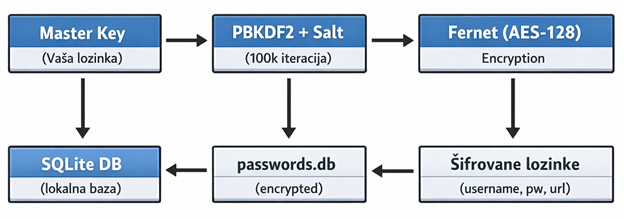
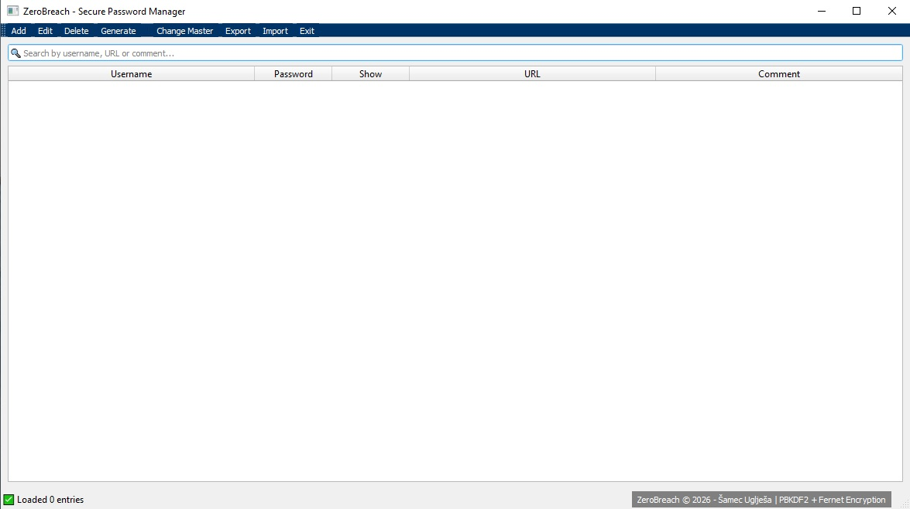

# ZeroBreach 🔐  
### Serbian Version 1.0 – Local • Zero-Knowledge • Enterprise Encryption

---

## 🛡 O projektu

**ZeroBreach** je lokalni menadžer šifara sa enkripcijom korporativnog nivoa koji čuva vaše lozinke bezbedno na vašem računaru.

Zero-knowledge arhitektura znači da **niko osim vas sa master lozinkom ne može pristupiti podacima**.

Aplikacija je 100% lokalna, napisana u Python-u sa PyQt5 interfejsom i predstavlja alternativu cloud menadžerima šifara.

---

## 🎯 Namenjeno za

- 👤 Privatne korisnike koji žele potpunu kontrolu nad podacima  
- 🏢 Male biznise koji ne veruju cloud rešenjima  
- 🔐 Sigurnosne entuzijaste koji žele enterprise enkripciju bez pretplate  
- 💻 Developere koji žele open-source alternativu komercijalnim rešenjima  

---

# ❓ Zašto ZeroBreach?

## Problemi sa cloud rešenjima

- Hackovi (npr. LastPass 2022)  
- GDPR komplikacije  
- Vendor lock-in  
- Pretplate 3–5€/mesec (36–60€/godina)  
- Morate verovati trećoj strani sa vašim podacima  

---

# 🚀 ZeroBreach Prednosti

- 🖥 **LOKALNO** – Podaci nikada ne idu na internet  
- 💰 **BESPLATNO** – Bez pretplate  
- 🔑 **VLAST** – Vi kontrolišete enkripcioni ključ  
- 👁 **OPEN-SOURCE** – Možete proveriti svaku liniju koda  

---

# 📊 ZeroBreach vs Popular Password Managers

| Prednost | ZeroBreach | Bitwarden | LastPass | 1Password | KeePass |
|-----------|-------------|------------|------------|------------|------------|
| 🚫 100% Offline | ✅ | ❌ Cloud | ❌ Cloud | ❌ Cloud | ✅ (ali zastareo UI) |
| 💰 Potpuno BESPLATNO zauvek | ✅ 0€ | ❌ 10€/god | ❌ 36€/god | ❌ 36€/god | ✅ |
| 🔧 Size (~100MB) | ✅ 100MB | ❌ | ❌ | ❌ | ❌ |
| ⚙️ Custom PBKDF2 (100k iter) | ✅ Bankovni nivo | ❌ Standard | ❌ | ❌ | ❌ |
| 🎨 Moderan PyQt5 Fusion UI | ✅ 2026 look | ❌ Web-based | ❌ Web-based | ✅ | ❌ XP look |
| 🔍 Instant Search (SQLite) | ✅ <50ms | ❌ | ❌ | ✅ | ❌ |
| 🧹 Automatski re-encrypt | ✅ Change master = instant | ❌ Manual | ❌ | ❌ | ❌ |
| 🔒 3-attempt HARD LOCK | ✅ Trajni lock.dat | ❌ Soft lock | ❌ | ❌ | ❌ |
| 📝 Comment kolona (searchable) | ✅ | ❌ | ❌ | ❌ | ❌ |

---
# 🏗 Tehnička Arhitektura

---

## 📷 Screenshot ekrana aplikacije

---

---

# 🔐 Sigurnosni Model

Master Password → PBKDF2 (100,000 iteracija + 16B salt) → master.key → Fernet (AES-128) → SQLite baza

### Bezbednosne karakteristike

- PBKDF2 – 100,000 iteracija  
- 16-byte salt (salt.bin)  
- SHA256 derivacija ključa  
- AES-128 enkripcija (Fernet)  
- 3 pogrešna pokušaja → TRAJNO zaključavanje (lock.dat)  
- Bez master.key = NEČITIVI PODACI (čak ni autoru)  
- Nema cloud sinhronizacije  

---

# 🔄 Life-Cycle Aplikacije

1. Instalacija → Master lozinka → Prazna baza  
2. Dodavanje lozinki → Svakodnevna upotreba  
3. Backup → Export DB + Private Key  
4. Migracija → Kopiranje foldera na novi računar  
5. Recovery → Import DB + Private Key  

---

# ⭐ Unikatne Vrednosti

- Podaci nikada ne napuštaju računar  
- Besplatno zauvek  
- Bankovni nivo zaštite (PBKDF2 100k)  
- Instant search – zero lag  
- Single `.exe` build  
- Potpuna transparentnost  

---

# ⚙ Funkcionalnosti

## ➕ Dodavanje / Edit Lozinke

1. Klikni **Add** ili **Edit**  
2. Unesi: Username*, Password*, URL, Comment  
3. Klikni **Generate Password**  
4. Klikni **Save**

---

## 🔎 Pretraga

- Pretražuje Username, URL i Comment  
- Real-time filtering  
- Status indikator: `🔍 Found X of Y entries`

---

## 👁 Prikaz Lozinke

1. Klikni **👁 Show**  
2. Lozinka se prikazuje umesto `🔒 *****`  
3. Klik ponovo za skrivanje  

---

## 🔑 Promena Master Lozinke

1. Tools → Change Master Password  
2. Unesi staru lozinku  
3. Unesi novu lozinku (2x)  
4. Automatska re-enkripcija svih podataka  

---

## 📤 Export / Import

### Export

1. Klikni **Export DB**  
2. OBAVEZNO sačuvaj PRIVATE KEY  
3. Bez ključa = trajno izgubljeni podaci  

### Import

1. Klikni **Import DB**  
2. Izaberi `.db` fajl  
3. Unesi PRIVATE KEY  
4. Restart aplikacije  

---

# 🛡 Sigurnost

## Master Lozinka

- 3 pogrešna pokušaja = TRAJNO zaključavanje  
- PBKDF2 (100,000 iteracija)  
- SHA256 derivacija  
- 16-byte salt  

## Podaci

- AES-128 enkripcija  
- SQLite lokalna baza  
- Automatska re-enkripcija pri promeni lozinke  

---

# 💾 Backup Strategija

1. Redovno raditi Export DB  
2. Čuvati PRIVATE KEY na sigurnom mestu (USB + offline kopija)  
3. Testirati import na drugom računaru  

---

# 🧠 Preventivne Mere

| Frekvencija | Aktivnost |
|------------|-----------|
| DNEVNO | Testiraj "Show" na 2-3 lozinke |
| SEDMIČNO | Export DB |
| MESEČNO | Testiraj Import |
| SVAKI PUT | Backup PRIVATE KEY |
| NIKAD | Ne menjaj master bez backup-a |

---

# 🧩 Česti Problemi & Rešenja

| Problem | Rešenje |
|----------|----------|
| DECRYPT ERROR | Pogrešna master lozinka ili oštećena baza |
| Aplikacija zaključana | Obriši lock.dat |
| Search ne radi | Restart aplikacije |
| Import fail | Proveri PRIVATE KEY |

---

# 📁 Folder Struktura

C:\Users[Korisnik]\AppData\Local\ZeroBreach\

master.key → PBKDF2 derivovani ključ (32B)
salt.bin → Salt (16B)
passwords.db → Šifrovana baza
lock.dat → Lock fajl

---

# ⚠ Reset (Gubi sve podatke)

1. Obriši ceo ZeroBreach folder  
2. Pokreni aplikaciju → nova instalacija  

---

# 📜 Licenca

Ovaj projekat je objavljen pod GPLv3 licencom.  
Ako koristite ili modifikujete kod, dužni ste da zadržite autorstvo i objavite izmene pod istom licencom.

---

> 🔐 Security First. Privacy Always.  
> Zero Knowledge Means Zero Trust.
